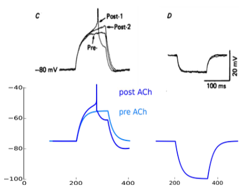

# tessera
A small set of helper functions to ease the developing of spiking neural networks in [PyNN](http://neuralensemble.org/docs/PyNN/index.html) by having all parameters, command line interpretation (also for parameter searches), and analysis, in one place. 

*tessera* is inspired from, and you can take it as a *very* simplified version of, [mozaik](https://github.com/antolikjan/mozaik). Hence its name, which is italian for the *tile* of a mosaic. 

## no need to install
*tessera* is meant to be a drop-in solution for cluster and neuromorphic deployment where you can only upload files but not install new libraries/packages/...

*tessera* is assuming that PyNN is installed with at least NEST. To ease the pain of installing a full stack with NEURON, NEST, numpy, matplotlib ... a docker image can do the job, for example neuralensembles/simulationx (see docker.com and the `Dockerfile` in *tessera*).

Therefore, **you don't** ~~`python setup.py install tessera`~~. You just clone it, enter the folder, and start driving PyNN.

## files
*tessera* is made of two files:

* helpers.py - contains all the routines to drive PyNN to define models and stimuli, run simulations (also for parameter searches), collect state values and save them as results ready to be analysed.
* run.py - contains the code to interpret various shell commands 

You then run your analysis as you want, based on PyNN's output files in the neo format. 

My personal set of function is in:

* analysis.py - additional routines for the analysis of simulation results

## how to
*tessera* enables you to drive PyNN through a dictionary of parameters. 

I built it to help me focus only on the core elements required to develop neural networks: the model parameters. 

In the directory `examples` you will find a series of files that illustrate the method I use to develop spiking neural networks: 
1. find electrophysiology data for the **cells**
  * fit PyNN single cells using the same experimental protocols
2. find electrophysiology data for the **synapses**
  * fit PyNN synapses using the same experimental protocols
3. find electrophysiology data for the **network**
  * build a PyNN network using: 
    * cells and synapses developed above
    * the experimental protocol closest to the available data

I wanted to model the cell excitability profiles and firing regimes associated with slow-wave sleep in a thalamo-cortical network of spiking neurons.

First, I needed to reproduce single cell responses to injection of excitatory and inhibitory current pulses, and to one-to-one synaptic interaction. Examples of these tasks are in the parameter files for [thalamic relay cell](examples/TC_response.py), [thalamic reticular cell](examples/RE_response.py), [cortical regular spiking cell](examples/RS_response.py), [cortical fast spiking cell](examples/FS_response.py). 

Then, I used the parameters found by fitting in-vitro studies above to build networks, using additional in-vitro and in-vivo intra- and extra-cellular measurements to constrain the building procedure. Examples of increasing complexity are in the parameter files for "in-vitro slice"-like networks ([thalamic network (delta and spindles)](examples/thalamic_delta_spindles.py), and [cortical network](examples/cortical_SW.py)), and "in-vivo"-like networks ([thalamocortical network (slow waves)](examples/thalamocortical_SW_delta.py), [thalamocortical network (spindles)](examples/thalamocortical_SW_Spindles.py)).

### how to: current injection in cortical pyramidal cell
First, I matched the single cell response to current injections of regular spiking pyramidal neurons in different input resistance states with corresponding available data. 

The parameter file [cortical regular spiking cell](examples/RS_response.py) contains all it is required to reproduce the behaviour of this type of cell, as found in the paper by McCormick and Prince "Mechanisms of action of acetylcholine in the guinea-pig cerebral cortex in vitro" (1986).

As cell excitability model, I chose the Adaptive exponential Integrate and Fire neuron (AdEx for short, see PyNN [docs](http://neuralensemble.org/docs/PyNN/reference/neuronmodels.html#pyNN.standardmodels.cells.EIF_cond_alpha_isfa_ista) for it). In the parameter file, the section `Populations` (line 25) collects all the PyNN populations of neurons that will be used. In this example there are only two populations (we will see the population `ext` later). The population `cell` is made of only one AdEx neuron (line 41):

    'type': sim.EIF_cond_alpha_isfa_ista,

Some parameters, like membrane capacitance and spike treshold, will be set from sources like [neuroelectro](https://www.neuroelectro.org/neuron/111/) (the reference for each parameter is inline comment of the parameter file).

Some other parameters, like time constant of leak conductance and resting potential, are found by iterating over the protocols in the paper and systematically searching within a range of values (we will see how below). 

For example, the Figure 3 in the paper illustrates the RS cell response to excitatory and inhibitory current pulses. In the parameter file, in the section `Injections` (line 145), you will find an essential reproduction of the experimental protocol of Figure 3.

    'source' : sim.StepCurrentSource,
    'amplitude' : [.15, .0], # depolarising
    # 'amplitude' : [-.15, .0], # hyperpolarising
    'start' : [200., 320.], # 

The parameter `source` is a proxy for the PyNN type of injection source, with its corresponding `amplitude` and times of injection (`start`). This is the minimal reproduction of the protocol used in the original paper from McCormick and Prince 1986.



#### how to: run this example
Enter the tessera folder

```
cd tessera
```

Copy the file from the examples folder to the working directory

```
cp examples/RS_response.py .
```

Run the code

```
python run.py --folder testRS --params RS_response.py nest
```

You can have help on the parameters by typing `python run.py --help`.

For a parameter search, the file `search.py` contains several examples of possible searches. To run searches, a file should be specified

```
python run.py --folder RS_search --params RS_response.py --search search.py nest
```

In case the simulation has run already and a new analysis algorithm has been developed, the analysis alone can be performed by specifying it at the command line

```
python run.py --folder RS_search --params RS_response.py --search search.py --analysis true nest
```

### how to: thalamocortical network
After modelling several types of cell matching in-vitro intracellular data, and thalamic and cortical networks using in-vitro slice data, I moved to a thalamocortical column with the goal of matching several available in-vitro andin-vivo data. 

For example, the parameter file [thalamocortical network (spindles)](examples/thalamocortical_SW_Spindles.py) contains all it is required to reproduce the overall statistics of the preparation as found in paper by VonKrosigk, Bal, and McCormick "Cellular Mechanisms of a Synchronized Oscillation in the Thalamus" (1993).

#### how to: run this example
Enter the tessera folder

```
cd tessera
```

Copy the file from the examples folder to the working directory

```
cp examples/thalamocortical_SW_Spindles.py .
```

Run the code

```
python run.py --folder testSpindles --params thalamocortical_SW_Spindles.py nest
```

## Docker Image
Everything you need (and more) to run *tessera* is found in the invaluable docker image *simulationx* maintained by Andrew Davison [here](https://hub.docker.com/r/neuralensemble/simulationx/):

* shell environment with NEST 2.14, NEURON 7.5, and PyNN 0.9 installed.
* The Python 2.7 version provides Brian 1.4, the Python 3.4 version provides Brian 2.
* IPython, scipy, matplotlib and OpenMPI are also installed.

I just included it in the *tessera* Dockerfile, simply adding the reference to this github repository.

### Basic Docker use
Start docker daemon

```
sudo systemctl restart docker
```

Enable the current user to launch docker images

```
sudo usermod -a -G docker $USER
```

Move to the folder `tessera` checked out from github and build the image

```
docker build -t tessera .
```

Check the existence of the image

```
docker images
```

Start a container with the *tessera* image

```
docker run -i -t tessera /bin/bash
```

And to allow for code development, bind-mount your local files in the container

```
docker run -v `pwd`:`pwd` -w `pwd` -i -t tessera /bin/bash
```

You can then run this code on any machine equipped with Docker. For example, I [tried](https://www.linkedin.com/pulse/exploring-gclouddocker-domenico-guarino) it on the Google Cloud platform.

